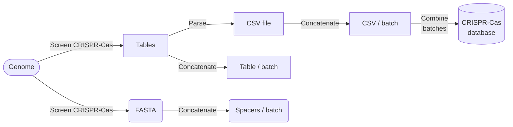
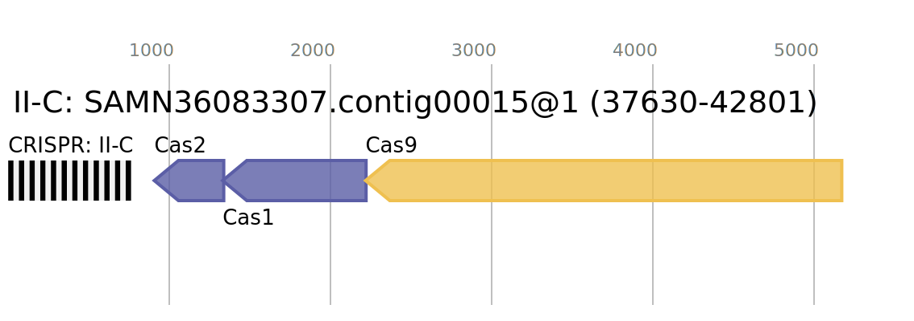

# Step-by-step explanation of the CRISPR-Cas screening workflow (simplified)



## 1. Screening genomes for presence of CRISPR-Cas :octicons-search-16:

We screen each input genome for the presence of CRISPR-Cas loci using
[CCTyper](https://github.com/Russel88/CRISPRCasTyper).
For a detailed overview of the method, please see the
[paper (preprint)](https://doi.org/10.1101/2020.05.15.097824).

We tune the CRISPR detection algorithm for increased sensitivity, following
the default length windows for spacers and repeats from
[CRISPRidentify](https://github.com/BackofenLab/CRISPRidentify#candidate-filtering-criteria).
That means repeats may be 21-55bp long, and spacers 18-78bp.
The defaults in CCTyper are repeats: 23-47 and spacers: 26-50.

Furthermore, by default CRISPR arrays can only be detected if 3 or more
repeats are detected. That means a minimum of 2 spacers, since these
are in between the repeats. However, we have identified genomes with
only one repeat and in rare cases even genomes with all the _Cas_ genes
with only one repeat and no spacers where presumably all spacers have
been lost. To accomodate the detection of CRISPR-Cas in these genomes,
we have set the minimum number of repeats to one, further increasing
the sensitivity for CRISPR-Cas screening.

CCTyper produces tab-separated output tables summarising results of:

1. Complete CRISPR-Cas systems (CRISPR + Cas locus)
2. Orphan CRISPR arrays (CRISPR spacers and repeats, without cas genes)
3. Cas operons (Any putative operon of cas genes, with or without CRISPR array)

It also saves the CRISPR spacer sequences as `.fa` file:
each array gets one FASTA file with spacers as separate entries/lines.

This is described in the `Snakefile` rule `crisprcastyper`.
The output files have the extension `.tab`.

CCTyper also provides a visual output for each identified locus, for example:

{width="560"}

### 1.1 Summarising the summaries :octicons-stack-16:

To facilitate further processing of the results reported by CCTyper,
we combine the most relevant results from the different `.tab` files
into one `.tsv` file: `CRISPR-Cas.tsv`. At the same time, the array/
operon names, start and stop positions and DNA sequence orientation
are collected and saved as `.bed` files.

This corresponds to rule `parse_cctyper`.
We do this using a custom script: [`bin/cctyper_expender.py`](https://github.com/UtrechtUniversity/campylobacter-crisprscape/blob/main/bin/cctyper_extender.py).

### 1.2 Practical detail on processing tens of thousands of genomes :octicons-number-16:

Genomes in AllTheBacteria have been split up in batches of up to 4,000
genomes, each of which is stored as separate fasta file. To process
large numbers of genomes, one may either process them all separately,
or combine (concatenate) them all in one large file and process them
as if they are a metagenome. We have conducted some tests to determine
the optimal processing method per tool and have found that CCTyper
works well with these concatenated genomes. For further details,
also see the
[development notes](dev_notes.md#use-of-gnu-parallel-over-snakemake).

As an added bonus, combining results from a large number of genomes is
also easier when they are combined as one input file!

To accomodate this batched processing method, an extra rule has been added
to `workflow/rules/helper_rules.smk`, which simply concatenates all
genome fasta files per batch in one file:

```yaml
rule concatenate_batches:
    input:
        "resources/ATB/assemblies/{batch}",
    output:
        "resources/ATB/assemblies-concatenated/{batch}.fasta",
    conda:
        "../envs/bash.yaml"
    threads: 1
    log:
        "log/concatenate_{batch}.txt",
    benchmark:
        "log/benchmark/concatenate_{batch}.txt"
    shell:
        r"""
cat {input}/*.fa > {output} 2> {log}
        """
```

### 1.3 Collect all identified CRISPR spacers :octicons-list-ordered-16:

CCTyper reports spacer sequences per array in a subdirectory of its output.
These are also concatenated into a single file, containing all the detected
CRISPR spacers: `results/spacers-primary.fasta`.

### Output files generated in the process :file_folder: :material-file-table: :material-file-table:

Each step in the process generates a number of output files, which by default
are written to:

```bash
results/
  cctyper/
    [batch]/
      CRISPR_Cas.tab        # Table with CRISPR-Cas loci
      crisprs_all.tab       # Table with all CRISPR arrays
      crisprs.gff           # Genome annotation (GFF) file with CRISPR-Cas loci
      crisprs_near_cas.tab  # Table of CRISPR arrays that are near Cas genes
      crisprs_orphan.tab    # Table of CRISPR arrays without Cas genes
      crisprs_putative.tab  # CRISPRs of all initially detected CRISPR-like arrays
      genes.tab             # Table with position of Cas genes
      hmmer.tab             # Table with alignments to putative Cas genes (HMMER)
      plot.png              # Figure of CRISPR-Cas loci (PNG)
      plog.svg              # Figure of CRISPR-Cas loci (SVG)
      spacers/              # Subdirectory with CRISPR spacers as fasta files
        [array_1].fa
        [array_2].fa
        ...
        [array_n].fa
```

For more details on the output files, see [output](output_files.md).

#### Next steps

&rarr; [Cluster spacers](clustering_spacers.md)

&rarr; [Refine CRISPRs](CRISPR_refinement.md)
